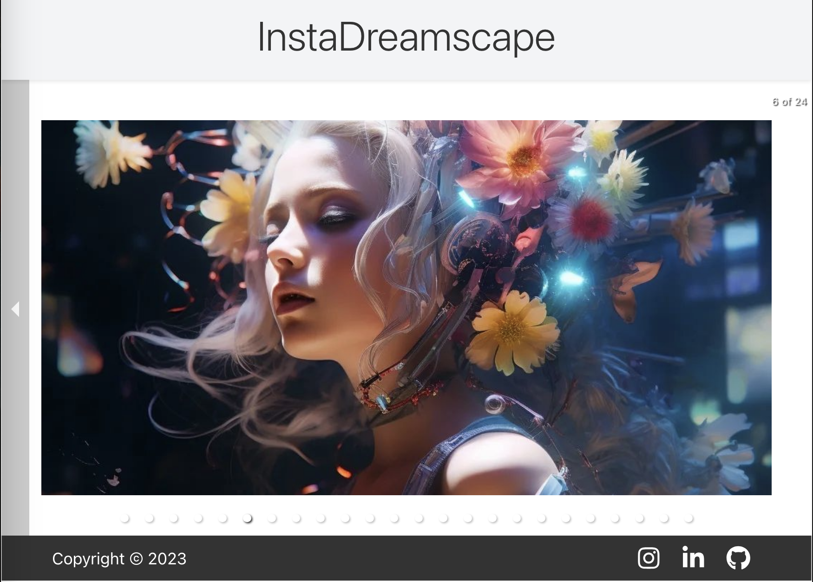

# InstaDreamscape Carousel

InstaDreamscape Carousel is a whimsical and ethereal React application that showcases a gallery of Instagram images in a carousel format.



## Features

- A responsive carousel that displays images from an Instagram feed.
- Hover effect to display image captions with a subtle fade transition.
- Links in captions that take the user to the original Instagram post.
- Social media icons in the footer for direct access to various profiles.
- A whimsical header titled 'InstaDreamscape' centered at the top of the page.

## Setup

To run this project, you'll need to install it locally using npm:

```
npm install
npm start
```

This will start the development server and open the application in your default browser.

## Usage

Before starting the app, ensure that you have the necessary access tokens set up to fetch data from Instagram's Graph API.

Set your Instagram access token in a `.env` file at the root of the project like so:

```
REACT_APP_INSTAGRAM_ACCESS_TOKEN=youraccesstokenhere
```

## Components

The project consists of several components structured to create a seamless user experience:

- `InstagramFeed`: Handles the fetching and display of Instagram images in a carousel.
- `Footer`: Contains social media links and copyright information.

## Styles

The application's aesthetic is achieved through meticulous CSS styling, ensuring that all elements align with the whimsical and ethereal theme.

## Contributing

Feel free to fork the project and submit pull requests. We appreciate your contributions to enhance the functionality or design of InstaDreamscape Carousel.

## License

This project is licensed under the MIT License - see the LICENSE.md file for details.

---

Powered by React and love for design.
