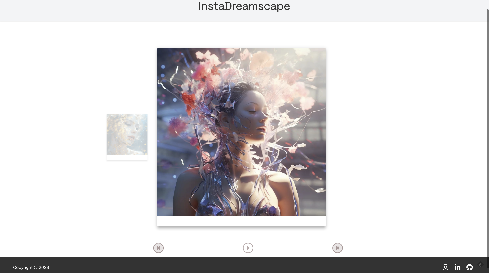

# Instagram Carousel

Instagram Carousel is a React-based web application that simulates the engaging carousel feature found on Instagram. Enhanced with a 3D perspective for a more immersive viewing experience, this app dynamically pulls the latest photos from an Instagram account using the Instagram Basic Display API, ensuring that users always have access to the most recent content.



## Features

- **Responsive Design**: Adapts seamlessly to different screen sizes for a consistent user experience.
- **Navigation Controls**: Easy-to-use previous and next buttons for image navigation.
- **Dynamic Image Loading**: Images are loaded dynamically from Instagram for easy updates and management.
- **Interactive Elements**: Includes a header, footer, and captions for a complete social media experience.

## Technologies Used

- **React**: A JavaScript library for building user interfaces, allowing for efficient updates and rendering of components.
- **CSS3**: Used for styling and creating the visual 3D effect of the carousel.
- **HTML5**: Provides the structure for the web application.
- **JavaScript (ES6)**: The scripting language used to create dynamic content on the web application.
- **npm**: A package manager for JavaScript, used to manage the app's dependencies.

## Libraries and CDNs

The application utilizes a variety of libraries and CDNs:

### Libraries from `package.json`

The application uses the following libraries from `package.json`:

- `@emotion/react`: For styling components inside React.
- `@emotion/styled`: Allows the definition of styled components.
- `@fortawesome/fontawesome-svg-core`: The core of Font Awesome, provides the fundamental building blocks for Font Awesome icons.
- `@fortawesome/free-brands-svg-icons`: Brand icons for social and other platforms.
- `@fortawesome/react-fontawesome`: Official React component for Font Awesome icons.
- `@mui/icons-material`: Material Design icons for React.
- `@mui/material`: Material UI components for React.
- `@testing-library/jest-dom`: Custom jest matchers to test the state of the DOM.
- `@testing-library/react`: React testing utilities.
- `@testing-library/user-event`: Simulate user events for testing.
- `bootstrap-icons`: Icon library for Bootstrap.
- `prop-types`: Runtime type checking for React props.
- `react`: The React library.
- `react-devtools`: Tools for debugging React applications.
- `react-dom`: DOM-specific methods that can be used at the top level of a web app to enable an efficient way of managing DOM elements of the web page.
- `react-icons`: An icon library that includes popular icons in React projects.
- `react-scripts`: Configuration and scripts for Create React App.
- `react-spring`: A spring physics-based animation library.
- `react-spring-3d-carousel`: A 3D carousel component built on top of react-spring.
- `uuid`: For the creation of RFC4122 UUIDs.
- `web-vitals`: For measuring performance on the web.

Please note that some of these libraries may be included in the standard `create-react-app` setup, but they are listed here for completeness and to ensure that all required libraries are explicitly defined.


### CDNs from `index.html`

- **[Bootstrap Icons](https://icons.getbootstrap.com/)**: Icon library for Bootstrap.
- **[Google Fonts](https://fonts.google.com/)**: For custom fonts in the application, specifically [Montserrat](https://fonts.google.com/specimen/Montserrat?query=montserrat) and [Space Grotesk](https://fonts.google.com/specimen/Space+Grotesk?query=space+grotesk).


## 3D Carousel Explanation

The carousel in this application is not just a flat sequence of images; it's a 3D carousel. This means that as you navigate through the images, they appear to have depth and perspective as if they are rotating around a central point in space. This effect is achieved through the use of advanced CSS3 styling, including `transform`, `perspective`, and `transition` properties, which give each image a sense of depth and make the transition between images appear three-dimensional.

## Components

The Instagram Carousel app is composed of several React components, each serving a distinct purpose to create a cohesive user experience:

- **Header.js**: This component renders the top part of the application, typically containing the app's title and any navigation links or branding related to the Instagram account.

- **Footer.js**: Similar to the Header, the Footer component is used to display information at the bottom of the application, such as copyright notices, contact information, or additional links.

- **Caption.js**: This component is responsible for rendering the text description associated with each image in the carousel. It typically appears below the image and can include hashtags, emojis, and other metadata from the Instagram post.

- **InstagramFeed.js**: The core component that interacts with the Instagram Basic Display API. It fetches the latest photos from the specified Instagram account and passes them to the carousel for display.

- **NavButtons.js**: Contains the navigation logic for the carousel. This component renders buttons or icons that allow the user to go to the next or previous image in the carousel.

- **PostCard.js**: Represents a single post within the carousel. This component combines the image with its Caption and includes any additional interactive elements, such as like and comment icons.

Each component is crafted to be self-contained, making the codebase modular and easy to manage. They work together to fetch, display, and navigate through the Instagram feed in a visually appealing 3D carousel format.


## Styles

Styling is accomplished using a combination of CSS3 and styled components from the `@emotion/styled` library:

- **CSS3**: Used for creating the 3D effects and transitions in the carousel, as well as for general layout and responsive design.
- **Styled Components**: Allows for writing CSS in JavaScript, providing scoped styles to components without the risk of style leakage.

## Instagram Integration

The Instagram Carousel app integrates with Instagram's Basic Display API to dynamically pull the latest photos from a connected Instagram account for display in the carousel. Here's how it works:

1. **API Setup**: The app uses the [Instagram Basic Display API](https://developers.facebook.com/docs/instagram-basic-display-api/), which requires an `access_token` obtained by setting up an Instagram app within the [Meta for Developers Site](https://developers.facebook.com/).
2. **Secure Token Storage**: The `access_token` is stored securely in a `.env` file as `REACT_APP_INSTAGRAM_ACCESS_TOKEN`, preventing it from being exposed in the source code.
3. **Data Retrieval**: The app makes authenticated requests to the Instagram API endpoint to fetch the latest media items associated with the account.
4. **React Rendering**: Using React's state management, the app stores the fetched media data and uses it to render the carousel's images.
5. **Carousel Display**: The carousel component creates a 3D slideshow of the images, with navigation controls allowing users to browse through the latest photos.
6. **Updates and Caching**: To ensure the carousel displays up-to-date content, the app can periodically check for new media from the Instagram account, caching results to optimize performance.


## Setting Up Instagram Access

To display images from Instagram, you need to set up access tokens using Instagram's Basic Display API. Follow these steps:

1. Go to the [Meta for Developers Site](https://developers.facebook.com/) and create an app.
2. Configure Instagram Basic Display, add an Instagram Test User, and then get the `access_token`.
3. Create a `.env` file in the root of your project.
4. Add the following line to your `.env` file:
   ```makefile
   REACT_APP_INSTAGRAM_ACCESS_TOKEN=youraccesstokenhere
   ```
5. Replace `youraccesstokenhere` with the access token you obtained from the Instagram Basic Display API.

Please note that the `.env` file should not be committed to your version control system. You should add `.env` to your `.gitignore` file.

## Getting Started

To get a local copy up and running follow these simple steps.

### Prerequisites

- npm
  ```sh
  npm install npm@latest -g
  ```

### Installation

To get started with the Instagram Carousel app, follow these steps:

1. **Clone the repo**
   ```sh
   git clone https://github.com/joshuadanpeterson/instagram-carousel.git
   ```

2. **Install NPM packages**
   ```sh
   npm install
   ```

### Usage

To start the application, run:

   ```sh
   npm start
   ```

This will launch the app in development mode. Open [http://localhost:3000](http://localhost:3000) to view it in the browser.

## Firebase Deployment

The Instagram Carousel app is deployed using Firebase Hosting, which provides fast and secure hosting for web app content. The app is accessible at the following URL: [https://instagram-carousel-c16b6.web.app/](https://instagram-carousel-c16b6.web.app/).

### Steps to Deploy to Firebase

To deploy the app to Firebase, follow these steps:

1. **Set up Firebase:**
   - Install the Firebase CLI globally by running `npm install -g firebase-tools`.
   - Authenticate to Firebase using `firebase login` and follow the on-screen instructions.

2. **Initialize Firebase in your project:**
   - Run `firebase init` in the root of your project directory.
   - Select `Hosting` when prompted for which Firebase features you want to set up.
   - Choose the Firebase project you want to connect to (in this case, `instagram-carousel-f95bb`).
   - Specify `build` as your public directory, which is where the build artifacts are located after running the build script.
   - Configure as a single-page app by responding `yes` when asked.

3. **Build your project:**
   - Run `npm run build` to create a production build of your app.

4. **Deploy to Firebase:**
   - Execute `firebase deploy` to deploy your app to Firebase Hosting.

After these steps, your app should be live at the provided Firebase URL.

### Continuous Deployment with GitHub Actions

This project is configured with GitHub Actions for continuous deployment. When changes are merged into the main branch, the app is automatically built and deployed to Firebase Hosting. The workflow is defined in the `.github/workflows/firebase-hosting-merge.yml` file.

For more details on Firebase Hosting and GitHub Actions integration, refer to the [Firebase documentation](https://firebase.google.com/docs/hosting/github-integration).

### Local Development

For local development, you can serve your app using Firebase Emulators to replicate the hosting environment on your local machine:

- Run `firebase emulators:start` to start the emulator.
- Access the app at the local URL provided by the Firebase CLI.

This allows you to test your changes in an environment similar to the production Firebase Hosting environment before deploying them.

## Contributing

Contributions are what make the open-source community such an amazing place to learn, inspire, and create. Any contributions you make are **greatly appreciated**.

1. Fork the Project
2. Create your Feature Branch (`git checkout -b feature/AmazingFeature`)
3. Commit your Changes (`git commit -m 'Add some AmazingFeature'`)
4. Push to the Branch (`git push origin feature/AmazingFeature`)
5. Open a Pull Request

## License

Distributed under the MIT License. See [[LICENSE]] for more information.

## Contact

Josh Peterson - [joshuadanpeterson@gmail.com](mailto:joshuadanpeterson@gmail.com?subject=Regarding%20Instagram%20Carousel%20GitHub%20Question)

Project Link: [https://github.com/joshuadanpeterson/instagram-carousel](https://github.com/joshuadanpeterson/instagram-carousel)

---

Powered by React and love for design.
